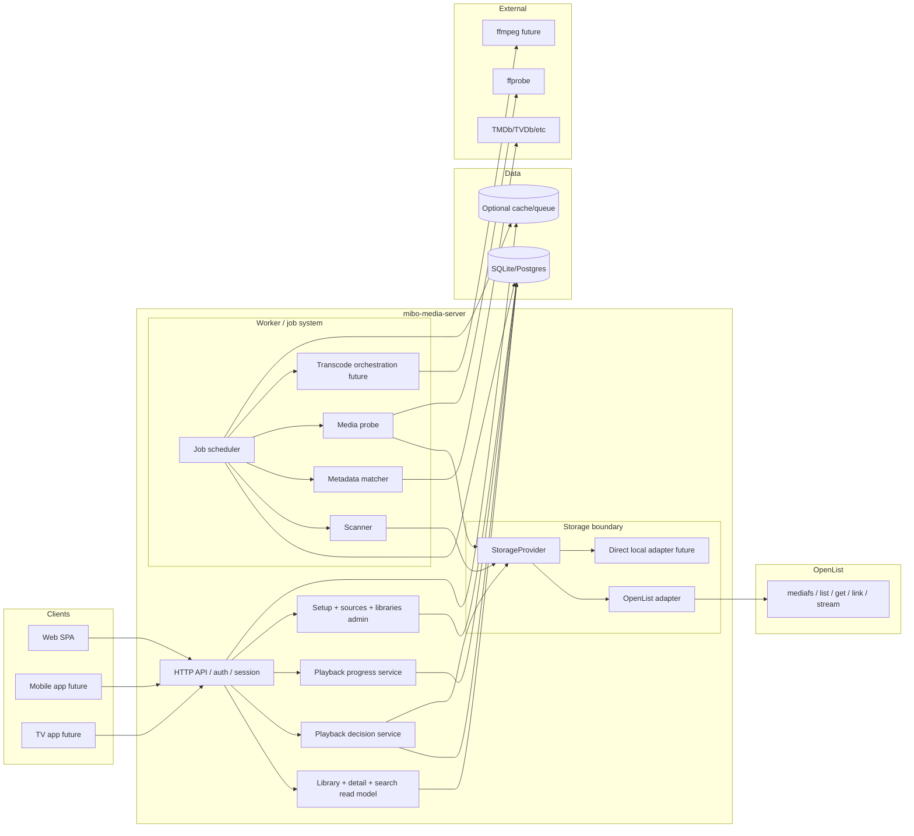

# Architecture Patterns

**Domain:** Self-hosted household media server with storage gateway boundary
**Project:** Mibo
**Researched:** 2026-04-21
**Overall confidence:** HIGH

## Recommended Architecture

Modern household media systems are typically structured as a **client-facing media core** sitting above a **storage access layer**, with **background jobs** handling expensive work and a **database-owned semantic model** for browse/playback state. Jellyfin and Plex both follow the broad pattern of: libraries are defined centrally, content is scanned into a server-side catalog, metadata is attached server-side, clients talk only to the media server, and transcoding is treated as a server capability rather than a storage concern. Navidrome reinforces the same split on the music side: scheduled scans, cache/data separation, and explicit scanner/transcoding knobs all live in the app layer, not the filesystem layer.

For Mibo, that means the right structure is:

1. **OpenList remains a storage gateway** for path space, listing, and file/link access.
2. **`mibo-media-server` owns media meaning**: libraries, media items, series/seasons/episodes, search, playback decisions, progress, and multi-client API shape.
3. **Worker paths own all slow or retryable work**: scan, identify, probe, transcode preparation, and later incremental refresh.
4. **A stable `StorageProvider` interface isolates the media core from OpenList details** so future direct adapters are optional optimizations, not architectural rewrites.

This is the right fit for a greenfield-with-brownfield project because the current code already has the beginnings of the correct boundaries (`internal/storage/provider.go`, `internal/worker/worker.go`, `internal/app/app.go`). The roadmap should therefore strengthen and sequence those boundaries, not replace them.



## Component Boundaries

The key rule is: **clients never talk to storage, and storage never owns media semantics**.

| Component | Responsibility | Talks To | Must Not Own |
|-----------|----------------|----------|--------------|
| Web / Mobile / TV clients | Render UI, authenticate, request browse/playback/progress APIs | API only | File paths, scan logic, metadata matching rules |
| API layer | Session/auth, request validation, read/write orchestration for online flows | Query services, playback service, progress service, admin services, DB | Deep scans, blocking metadata enrichment, long-running media analysis |
| Library/query services | Home, lists, detail pages, search views, read models over normalized media data | DB, optional cache | Raw storage traversal policy |
| Playback service | Decide direct play vs remux/transcode fallback, return stream/manifest endpoints | DB, StorageProvider, transcode orchestration | Library scanning, metadata scraping |
| Progress service | Save/resume watch state and multi-client sync semantics | DB | File access, transcoding |
| Job scheduler/service | Queue, claim, retry, schedule background tasks | DB, worker runners | User-facing read APIs |
| Scanner worker | Traverse library roots, persist `media_files`, enqueue follow-up jobs | StorageProvider, DB, jobs | Final metadata truth beyond fast-path heuristics |
| Metadata matcher worker | Convert files/items into semantic media entities | DB, metadata providers | Storage traversal |
| Probe worker | Collect technical stream/container/runtime info | StorageProvider, ffprobe, DB | User-facing playback policy |
| Transcode orchestration worker | Prepare/track fallback transcodes when direct play fails | FFmpeg, DB, playback service | Library ownership |
| `StorageProvider` boundary | Stable contract for list/get/link/capabilities/resolve operations | OpenList adapter now, direct adapters later | Media item modeling, client-specific playback rules |
| OpenList adapter | Translate `StorageProvider` calls into OpenList HTTP/mediafs calls | OpenList HTTP API | Any media-domain tables or browse semantics |
| OpenList | Mount storage and normalize file access across local/NAS/cloud backends | Underlying storage | Media metadata, progress, continue watching |
| Database | Durable source of truth for libraries, jobs, media graph, playback state | All server-side services | Remote storage connectivity |

## Data Flow

### 1. Library ingestion flow

**Direction:** Admin/API → jobs → worker → storage boundary → DB

1. User creates or updates a library in the API.
2. API writes library config to DB and enqueues `sync_library`.
3. Worker claims the job.
4. Scanner traverses the library through `StorageProvider`.
5. OpenList adapter resolves list/get/link calls against OpenList.
6. Scanner writes/updates `media_files` and cheap file-derived hints.
7. Scanner enqueues metadata/probe follow-up jobs.
8. Matcher/probe workers enrich semantic tables and technical playback facts.

**Implication:** scanning is an eventually consistent ingestion pipeline, not an API request.

### 2. Browse/query flow

**Direction:** Client → API → DB-backed read model → Client

1. Client requests home, library, show, movie, or episode views.
2. API reads normalized tables (`media_items`, `series`, `seasons`, `episodes`, progress summaries).
3. Response is assembled without calling OpenList except for lightweight edge cases.

**Implication:** the browsing experience must survive storage slowness; most user-facing reads should come from DB, not live directory listing.

### 3. Playback flow

**Direction:** Client → API/playback service → DB + storage boundary → direct link or server stream → progress writeback

1. Client requests playback for a semantic item.
2. Playback service resolves the chosen backing `media_file` from DB.
3. Playback service asks `StorageProvider` for capabilities/link.
4. If direct play works, return direct/proxied URL.
5. If not, route to remux/transcode fallback.
6. Client reports progress; progress service writes DB state independently.

**Implication:** playback is based on **semantic media identity first**, storage object second.

### 4. Incremental refresh flow

**Direction:** Scheduler or storage event → jobs → targeted worker scan → DB patch

1. V1 uses manual and scheduled scans.
2. Later, OpenList-originated change events or directory cursors trigger targeted jobs.
3. Worker rescans affected paths only.
4. Changed files cause re-identify/re-probe only when necessary.

**Implication:** incremental refresh is an extension of the same job pipeline, not a separate subsystem.

## Patterns to Follow

### Pattern 1: Semantic core over file gateway
**What:** Keep raw file access at the boundary and build all product features on semantic entities (`media_items`, `series`, `episodes`, progress records).
**When:** Always; especially for home, continue-watching, detail pages, and playback.

### Pattern 2: API fast path, Worker slow path
**What:** API only performs bounded-latency work; scans, identification, probe, artwork generation, and transcoding orchestration run asynchronously.
**When:** Any operation that may touch many files, external APIs, or CPU-heavy tools.

### Pattern 3: Adapter-first storage integration
**What:** Depend on `StorageProvider` in domain services, not on OpenList-specific payloads.
**When:** Any library, playback, or probe code that needs file access.

### Pattern 4: Read model first for clients
**What:** Shape the DB around client-facing views, then expose stable APIs to Web/Mobile/TV.
**When:** Browse/search/detail/home/progress features.

## Anti-Patterns to Avoid

### Anti-Pattern 1: Letting OpenList leak upward
**What:** UI or domain services depend on OpenList paths, API schemas, or behavior quirks.
**Why bad:** Couples product semantics to gateway implementation and makes adapter replacement expensive.
**Instead:** Convert OpenList objects into `StorageProvider` types immediately.

### Anti-Pattern 2: Browsing from live directory trees
**What:** Build primary app screens by listing storage on demand.
**Why bad:** Slow, fragile, and impossible to support rich semantics like continue watching or season grouping cleanly.
**Instead:** Browse from DB; rescan in the background.

### Anti-Pattern 3: Doing heavy enrichment inside request handlers
**What:** Match metadata, run ffprobe, or generate transcode artifacts during normal browse/playback API calls.
**Why bad:** Unpredictable latency and resource contention.
**Instead:** enqueue jobs and return current state.

### Anti-Pattern 4: Early microservice splits
**What:** Separate scan, playback, metadata, and search into independent deployables now.
**Why bad:** Operational cost rises faster than user value in a household deployment.
**Instead:** keep one codebase/process shape with clear internal seams; split worker deployment first if needed.

## Suggested Build Order

This should drive roadmap phase ordering.

### Phase 1: Stabilize the storage boundary and library/job foundation
**Build first because everything else depends on it.**

- Lock the `StorageProvider` contract (`List`, `Get`, `Link`, `ResolveStorage`, `Capabilities` are already present).
- Keep OpenList as the only production adapter for now.
- Normalize source/library configuration and job lifecycle.
- Make API and worker separation explicit even if they ship in one process/image.

**Dependency unlocked:** reliable ingestion pipeline.

### Phase 2: Build the file catalog and scan orchestration
- Persist library roots, `media_files`, scan checkpoints, and job retries.
- Make `sync_library` the canonical ingestion entrypoint.
- Support full scan first, scheduled/manual refresh second.

**Dependency unlocked:** a DB-backed catalog that other features can consume.

### Phase 3: Build the media semantic graph
- Promote file records into `media_items`, `series`, `seasons`, `episodes`.
- Separate cheap filename classification from slower metadata matching.
- Store stable relationships needed for browse/detail UX.

**Dependency unlocked:** meaningful app screens and playback addressing by media identity.

### Phase 4: Build query APIs for multi-client consumption
- Home, library, detail, search, continue watching, and admin read APIs.
- Shape responses around Web/Mobile/TV use, not around storage tree traversal.

**Dependency unlocked:** clients stop depending on raw file semantics.

### Phase 5: Build playback resolution and progress sync
- Playback service resolves semantic item → backing file → direct link/fallback.
- Add durable progress and resume behavior.
- Keep “direct play first” as the default policy.

**Dependency unlocked:** end-to-end household usage.

### Phase 6: Add probe and technical playback intelligence
- Run `ffprobe` asynchronously.
- Persist codec/container/stream facts.
- Improve playback decisions and unsupported-client handling.

**Dependency unlocked:** smarter direct-play vs fallback decisions.

### Phase 7: Add transcode fallback and incremental refresh
- Introduce HLS/remux/transcode only where direct play is insufficient.
- Add targeted rescans from schedules and later storage events.
- Add Redis/cache only if queueing or caching pressure shows up.

**Dependency unlocked:** robustness at larger libraries or weaker clients.

### Phase 8: Optimize hotspots, not the whole architecture
- Add direct local/NAS adapters only for measured bottlenecks.
- Split worker deployment before splitting domain services.

**Dependency unlocked:** scale improvements without a rewrite.

## Build Order Dependency Graph

```text
StorageProvider boundary + jobs
  -> scan/catalog pipeline
  -> semantic media graph
  -> query APIs
  -> playback + progress
  -> probe intelligence
  -> transcode fallback + incremental refresh
  -> direct adapters / scaling optimizations
```

## Brownfield Implications For Mibo

- **Keep:** the existing `Provider` interface, worker runner, and app wiring are the right skeleton.
- **Strengthen:** make the semantic/media graph the center of the product, not `App.tsx` UI state or raw storage objects.
- **Move out of request paths:** any remaining scan/identify/probe work that still happens synchronously.
- **Do not build next:** custom storage protocol stacks or deep OpenList modifications.
- **Prefer next:** clearer internal service seams and DB-backed query models that support Web now and Mobile/TV later.

## Scalability Considerations

| Concern | At 100 users / household scale | At 10K users / hosted multi-tenant scale | At 1M users |
|---------|-------------------------------|------------------------------------------|-------------|
| API vs worker contention | Single deployment is fine; separate goroutines/process roles | Split worker deployment first | Fully separate compute pools |
| Storage latency | Accept OpenList HTTP overhead | Add caching and targeted rescans | Likely need specialized storage architecture |
| DB load | SQLite or Postgres works | Prefer Postgres, tuned indexes/read models | Sharding/search infra needed |
| Transcoding | Optional/fallback only | Dedicated transcoding workers | Separate media pipeline platform |
| Queueing | DB jobs enough | Redis/queue becomes useful | Dedicated distributed queue |

For this project, the first column is the target. The middle column only matters if Mibo later stops being a household system.

## Recommendation

The correct architecture for Mibo is a **single media-core service with explicit internal boundaries**, not a forked storage platform and not a microservice mesh. OpenList should stay at the edge as an interchangeable file gateway. `mibo-media-server` should own the semantic catalog, playback policy, and client API contract. The roadmap should therefore build from **boundary -> ingestion -> semantics -> query -> playback -> optimization**.

## Sources

- Local project context: `/Users/atlan/Desktop/IdeaProjects/Mibo/.planning/PROJECT.md` — HIGH
- Local architecture proposal: `/Users/atlan/Desktop/IdeaProjects/Mibo/docs/media-architecture/improved-architecture.md` — HIGH
- Current code boundaries: `/Users/atlan/Desktop/IdeaProjects/Mibo/mibo-media-server/internal/storage/provider.go` — HIGH
- Current code boundaries: `/Users/atlan/Desktop/IdeaProjects/Mibo/mibo-media-server/internal/worker/worker.go` — HIGH
- Current code wiring: `/Users/atlan/Desktop/IdeaProjects/Mibo/mibo-media-server/internal/app/app.go` — HIGH
- Jellyfin Libraries docs: https://jellyfin.org/docs/general/server/libraries/ — MEDIUM
- Jellyfin Metadata docs: https://jellyfin.org/docs/general/server/metadata/ — MEDIUM
- Jellyfin Tasks docs: https://jellyfin.org/docs/general/server/tasks/ — MEDIUM
- Jellyfin Transcoding docs: https://jellyfin.org/docs/general/post-install/transcoding/ — MEDIUM
- Jellyfin Hardware Acceleration docs: https://jellyfin.org/docs/general/post-install/transcoding/hardware-acceleration/ — MEDIUM
- Plex overview / server-client model: https://support.plex.tv/articles/200288286-what-is-plex/ (last modified 2025-01-07) — MEDIUM
- Navidrome configuration and scanner/transcoding options: https://www.navidrome.org/docs/usage/configuration/options/ (last modified 2026-04-19) — MEDIUM
