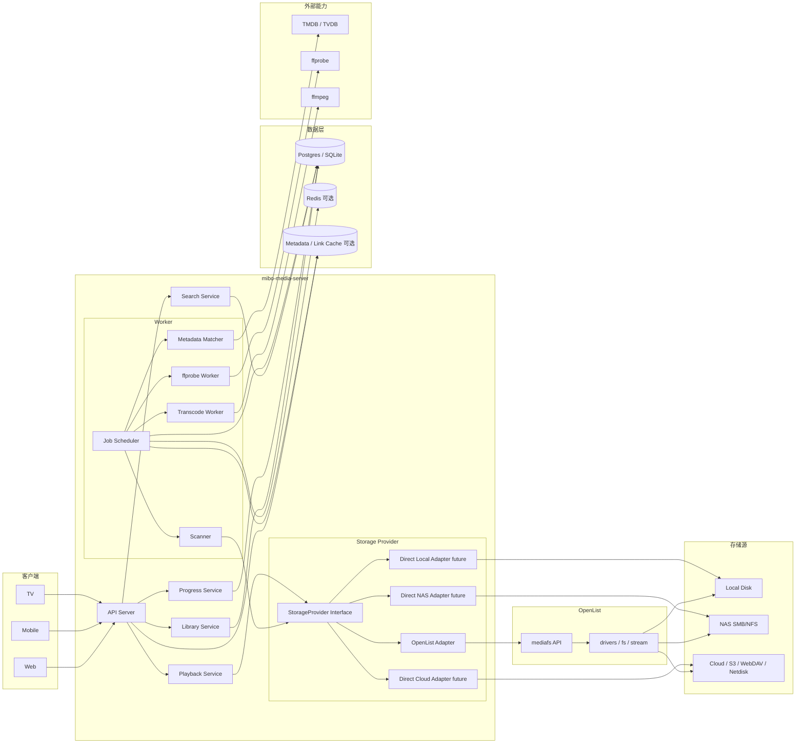
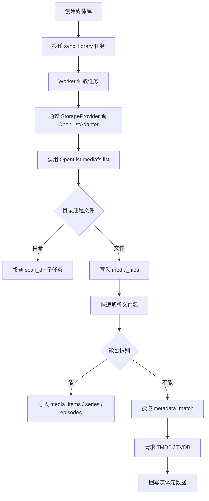
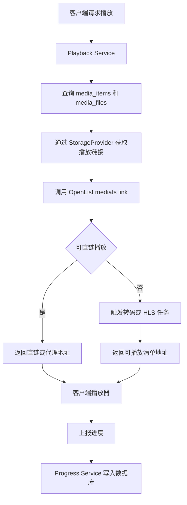
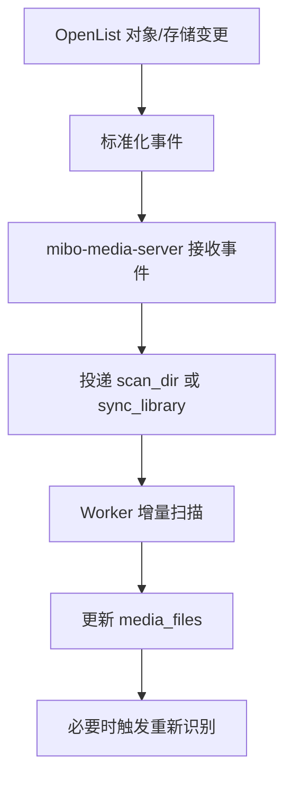
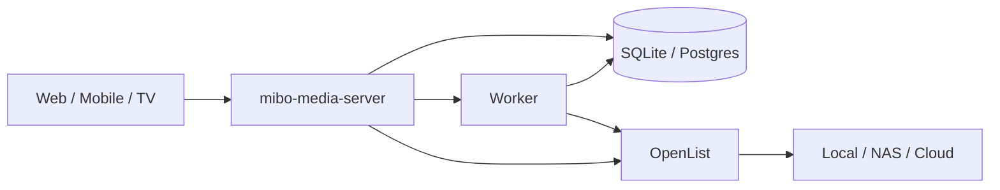

# Mibo 架构设计

本文档定义 `OpenList + mibo-media-server` 方案的推荐架构，用于指导后续的扫描、识别、播放、多端接入与性能演进。

## 1. 设计结论

当前推荐架构不是“重度魔改 OpenList”，也不是“一开始就拆成很多微服务”，而是：

- `OpenList` 负责存储接入与文件访问
- `mibo-media-server` 负责媒体语义与产品能力
- `mibo-media-server` 内部定义稳定的 `StorageProvider` 抽象
- `OpenList` 只是第一个 `StorageProvider` 适配器
- API 与 Worker 职责分离，但 V1 可以保持简单部署

一句话总结：

> 保留 OpenList 作为存储底座，把媒体系统做成独立业务核心，并在媒体服务内部预留可替换的存储适配边界。

## 2. 架构目标

这套架构需要同时满足以下目标：

- 支持本地磁盘、NAS、云盘的统一接入
- 支持媒体库扫描、识别、播放、进度同步
- 支持 Web、移动端、TV 端统一访问
- 保持 V1 可快速落地
- 允许后续按需绕过 OpenList 提升局部性能
- 避免 OpenList 与媒体业务深度耦合，降低长期维护成本

## 3. 核心原则

### 3.1 职责单一

- OpenList 解决“文件在哪里、如何访问”
- `mibo-media-server` 解决“这些文件是什么媒体、如何展示和播放”

### 3.2 先跑通，再优化

- V1 优先复用 OpenList 的 `list/get/link/stream`
- 不在第一版就直连所有存储协议
- 性能优化建立在真实瓶颈之上，而不是预先复杂化

### 3.3 适配器优先

- 业务层不直接依赖 OpenList 的具体实现细节
- 业务层只依赖 `StorageProvider` 抽象
- OpenList 只是一个 adapter，而不是不可替换的核心

### 3.4 API 与后台任务分离

- 用户请求走 API 路径
- 扫描、识别、`ffprobe`、转码走 Worker 路径
- 避免慢任务直接占用在线请求资源

## 4. 总体架构图

## 5. 模块职责

### 5.1 OpenList

OpenList 只负责存储和文件访问能力：

- 挂载本地磁盘、NAS、云盘
- 统一路径空间
- 提供文件级能力：`list`、`get`、`link`、`stream`
- 提供 driver 层差异抹平
- 提供对象更新和存储更新事件入口

OpenList 不负责：

- 电影/剧集识别
- 媒体元数据
- 播放进度
- 继续观看
- 转码策略
- TV / 移动端业务 API

### 5.2 mibo-media-server API

API 层对客户端提供统一媒体能力：

- 媒体库查询
- 首页、分类、搜索
- 详情页查询
- 播放地址生成
- 播放进度上报与同步

API 层不直接做重扫描或重计算，只读数据库和轻量调用存储层。

### 5.3 mibo-media-server Worker

Worker 负责后台任务：

- 全量扫描
- 增量扫描
- 文件分类
- 元数据匹配
- `ffprobe` 信息补全
- 转码任务调度

Worker 是性能演进的关键，后续如果压力增大，优先把 Worker 独立扩容，而不是先拆更多服务。

### 5.4 StorageProvider

`StorageProvider` 是 `mibo-media-server` 内部的稳定边界。

V1 至少要有：

- `List`
- `Get`
- `Link`
- `ResolveStorage`
- `Capabilities`

后续可选能力：

- `StableIdentity`
- `DeltaScan`
- `BatchStat`

这层的意义是：

- 上层业务代码不直接依赖 OpenList
- 后续可以在不改业务层的情况下新增直连适配器

## 6. 核心链路

### 6.1 扫描链路

设计要点：

- 扫描与识别分层
- 首轮扫描只做快路径
- 慢路径通过后台任务补全
- 未来支持基于事件或游标的增量扫描

### 6.2 播放链路

设计要点：

- 播放层只面向媒体项，不面向原始文件树
- 优先直链，转码只做兜底
- 播放进度和媒体访问解耦

### 6.3 增量更新链路

V1 可以先保留手动扫描和定时扫描；事件驱动增量扫描作为下一阶段增强。

## 7. 数据边界

### 7.1 OpenList 的数据职责

OpenList 负责：

- storage 配置
- mount path
- driver 状态
- 文件级访问语义

### 7.2 mibo-media-server 的数据职责

`mibo-media-server` 负责：

- `libraries`
- `jobs`
- `media_files`
- `media_items`
- `series`
- `seasons`
- `episodes`
- `playback_progress`

核心原则：

- 文件命名空间由 OpenList 提供
- 媒体语义和用户状态由 `mibo-media-server` 持有

## 8. 部署建议

### 8.1 V1 部署

V1 保持简单：

建议：

- 可以先单机部署
- 可以先共用同一个进程镜像中的 API 与 Worker
- 数据库优先 `SQLite` 或 `Postgres`
- `Redis` 不是第一版必须项

### 8.2 后续演进

当出现以下问题时再升级部署：

- API 延迟明显受扫描影响
- `ffprobe` 或转码任务抢占 CPU/IO
- 媒体库规模增长明显
- 云盘/NAS 延迟导致任务堆积

升级方向：

- Worker 独立部署
- 引入 `Redis` 做队列/缓存
- 为热点本地路径引入 `Direct Local Adapter`

## 9. 为什么这套架构优于其他方案

### 9.1 对比“深度 fork OpenList”

本方案更好，因为：

- 上游同步成本更低
- 业务边界更清晰
- 更适合 Web / Mobile / TV 多端演进
- 避免把媒体系统绑死在文件管理产品形态上

### 9.2 对比“完全自己重写存储层”

本方案更好，因为：

- 更快落地
- 能立即支持多种存储后端
- 不需要自己长期维护大量协议和网盘驱动

### 9.3 对比“一开始拆很多微服务”

本方案更好，因为：

- 家庭自用场景不需要过早复杂化
- 故障定位更简单
- 开发效率更高
- 后续仍可按瓶颈逐步拆分

## 10. 已知风险

需要明确接受以下风险：

- OpenList 仍可能成为扫描链路的热点
- HTTP 适配层在大规模目录遍历时会有额外开销
- 云盘临时链接与 Range 支持差异会影响播放体验
- V1 如果没有稳定文件身份能力，重命名检测会比较弱

这些风险在当前阶段是可接受的，因为它们都可以在不推翻主架构的前提下逐步优化。

## 11. 演进路线

建议按以下顺序推进：

1. 完成 `library + jobs + scanner`
2. 完成 `media_items / series / seasons / episodes`
3. 完成文件识别和元数据匹配
4. 完成播放接口与进度同步
5. 接入 `ffprobe`
6. 补事件驱动增量扫描
7. 仅在有真实收益时增加直连适配器

## 12. 架构决策

最终采用的架构决策如下：

- 保留 OpenList
- 不把媒体业务深度塞进 OpenList
- `mibo-media-server` 作为业务核心
- 在 `mibo-media-server` 内部建立稳定的 `StorageProvider` 边界
- API 与 Worker 保持职责分离
- 先做可运行单体，再按瓶颈演进

这是当前阶段在交付速度、维护成本和长期扩展性之间最平衡的方案。
